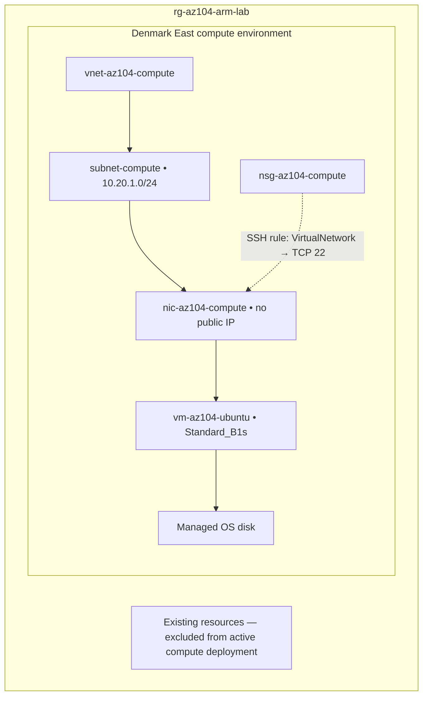
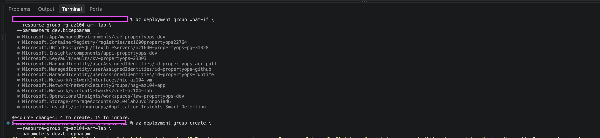
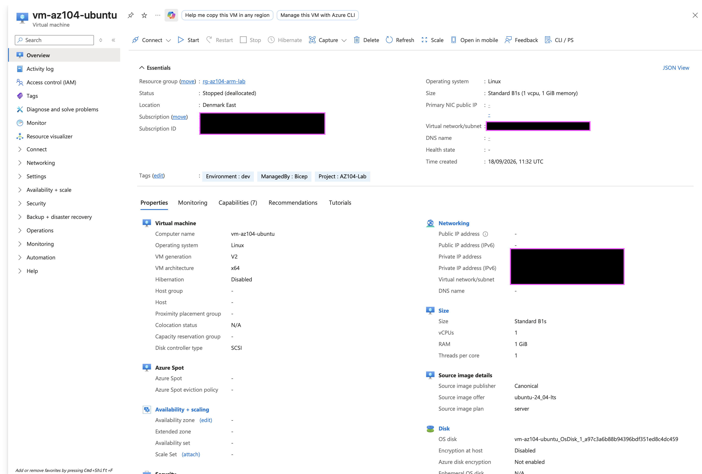
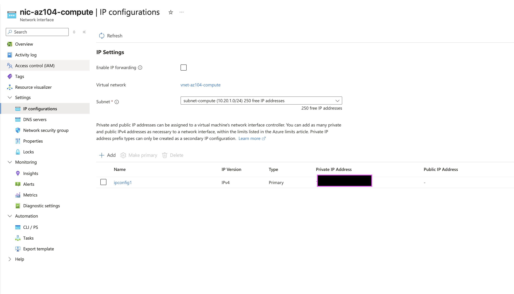
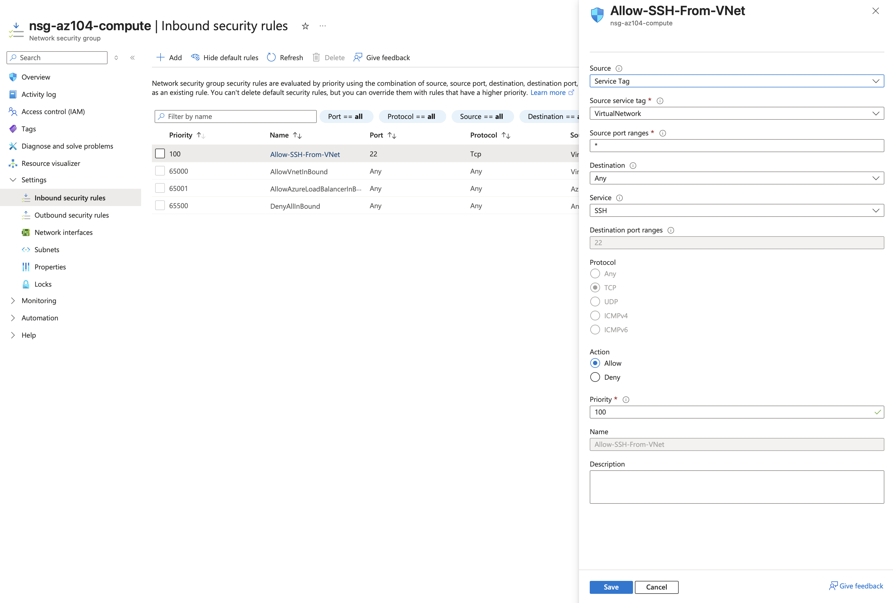

cat > README.md <<'EOF'
# AZ-104 Azure Infrastructure Lab

An Azure infrastructure project built while preparing for the Microsoft
AZ-104 certification, covering modular Bicep, private networking, Linux
virtual machines, deployment review, and operational verification.

## Project Overview

This lab follows a repeatable infrastructure deployment workflow:

**Build → Validate → What-If → Deploy → Verify**

The main troubleshooting exercise involved resolving a regional VM SKU
restriction while protecting existing resources from unintended changes.

The recorded deployment successfully provisioned an Ubuntu VM in Denmark
East. After verification, the VM was deallocated.

## Infrastructure

| Component | Configuration |
|---|---|
| Resource group | `rg-az104-arm-lab` |
| Compute region | Denmark East |
| Virtual network | `vnet-az104-compute` |
| Subnet | `subnet-compute` — `10.20.1.0/24` |
| Network security group | `nsg-az104-compute` |
| Network interface | `nic-az104-compute` |
| Virtual machine | `vm-az104-ubuntu` |
| Operating system | Ubuntu 24.04 LTS |
| VM size | `Standard_B1s` |
| Public IP | None |
| Authentication configuration | SSH public key |
| Last recorded power state | Stopped (deallocated) |

## Architecture



The diagram summarizes the compute resources and security rule. Effective
traffic filtering depends on the deployed NSG associations and all
applicable rules.

## Repository Layout

```text
.
├── azuredeploy.bicep
├── dev.bicepparam
├── modules/
├── docs/
│   └── screenshots/
│       ├── what-if.png
│       ├── vm-deallocated.png
│       ├── nic-configuration.png
│       └── nsg-ssh-rule.png
├── README.md
└── learn.md
```

## Deployment Evidence

### Pre-deployment What-If review

The original preview proposed four resource creations and left 15 existing
resources ignored, with no modifications or deletions proposed.



This is historical evidence from before deployment. Subsequent previews
can differ because the resources now exist.

### VM verification and deallocation

The portal shows the Linux VM in Denmark East using Standard_B1s, with no
public IP. After deployment verification, the VM was deallocated.



### Network interface configuration

The compute NIC connects to subnet-compute within vnet-az104-compute.
Its primary IPv4 configuration has no associated public IP.



### SSH security rule

The Allow-SSH-From-VNet rule permits inbound TCP traffic on port 22 from
the VirtualNetwork service tag, with priority 100.



This screenshot documents the configured rule. It does not demonstrate a
successful SSH connection or that all other inbound traffic is blocked.

## Deployment Workflow

### Prerequisites

- Azure CLI with Bicep support.
- An Azure subscription with suitable deployment permissions.
- The target resource group.
- An SSH key pair, with the public key configured in the deployment parameters.
- A VM size available to the subscription in the selected region.

Review `dev.bicepparam`, the selected subscription, and the target resource
group before deployment. Denmark East and Standard_B1s were successful for
this lab; availability can vary.

### 1. Build

```bash
az bicep build --file azuredeploy.bicep
```

### 2. Validate

```bash
az deployment group validate \
  --resource-group rg-az104-arm-lab \
  --parameters dev.bicepparam
```

Review diagnostics as well as the overall result. Validation can succeed
while reporting that some nested resources were skipped during evaluation.

### 3. Preview changes

```bash
az deployment group what-if \
  --resource-group rg-az104-arm-lab \
  --parameters dev.bicepparam
```

Inspect proposed creations, modifications, and deletions before proceeding.

### 4. Deploy

This command creates or updates Azure resources and can incur charges.

```bash
az deployment group create \
  --resource-group rg-az104-arm-lab \
  --parameters dev.bicepparam
```

### 5. Verify

```bash
az vm show \
  --resource-group rg-az104-arm-lab \
  --name vm-az104-ubuntu \
  --show-details \
  --query "{Name:name,Location:location,Size:hardwareProfile.vmSize,ProvisioningState:provisioningState,PowerState:powerState,PrivateIP:privateIps,PublicIP:publicIps}" \
  --output table
```

## Troubleshooting and Decisions

### Regional VM SKU restriction

The initial UK South compute attempt encountered a SKU restriction.
A separate `computeLocation` parameter allowed the compute environment
to use Denmark East without changing the location of earlier resources.

### Protecting existing resources

Earlier network and storage module calls were commented out of the active
deployment path. The new compute environment used a separate network.

The deployment used incremental mode. Omitted resources were retained,
but included resources could still be modified. What-If was therefore
reviewed before deployment.

### Validation warnings

Unused-parameter warnings remained after earlier module calls were
disabled. These identified future template cleanup work.

Validation also reported a nested-deployment evaluation warning.
An overall successful result was not treated as proof that every nested
resource had been fully checked.

### Post-deployment review

A later What-If run reported:

- 1 resource to modify: the compute NIC.
- 3 resources unchanged.
- 16 resources ignored.

The NIC differences require investigation before being classified as
template drift or service-generated defaults. No changes were applied
by that What-If command.

### Private VM access

The VM has no public IP. An NSG allow rule alone does not provide a network
path from a laptop to the VM's private address.

Successful secure SSH access remains a follow-up exercise.

## Cost Management

The VM was deallocated after verification:

```bash
az vm deallocate \
  --resource-group rg-az104-arm-lab \
  --name vm-az104-ubuntu
```

Its power state was checked with:

```bash
az vm get-instance-view \
  --resource-group rg-az104-arm-lab \
  --name vm-az104-ubuntu \
  --query "instanceView.statuses[?starts_with(code, 'PowerState/')].displayStatus | [0]" \
  --output tsv
```

The recorded result was `VM deallocated`. Managed disks and other retained
resources can still incur charges.

The resource group contains other resources, so cleanup requires a
resource inventory and dependency review.

## Next Steps

- Investigate the NIC differences in the post-deployment What-If result.
- Complete and document secure SSH access.
- Exercise managed identity and scoped RBAC.
- Add Azure Monitor and Log Analytics.
- Explore private connectivity.
- Configure and test backup and recovery.
- Remove unused parameters and improve module organization.

## Learning Notes

See [learn.md](learn.md) for troubleshooting decisions and lessons learned.
EOF

Olawale Azeez
AWS Certified Developer Associate AWS Certified Solutions Architect -Associate
AWS Certified Cloud Practitioner
Cloud Engineer | Platform Engineer | DevOps Engineer