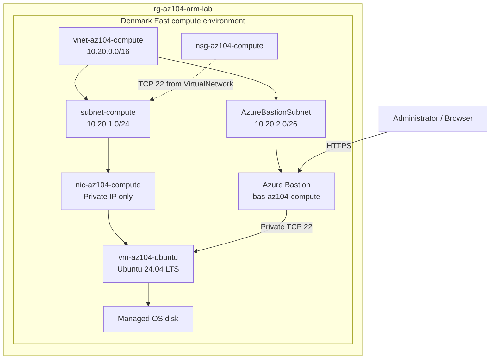
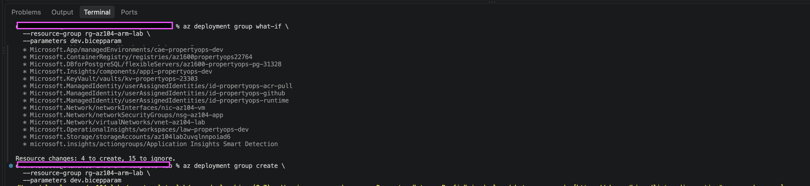
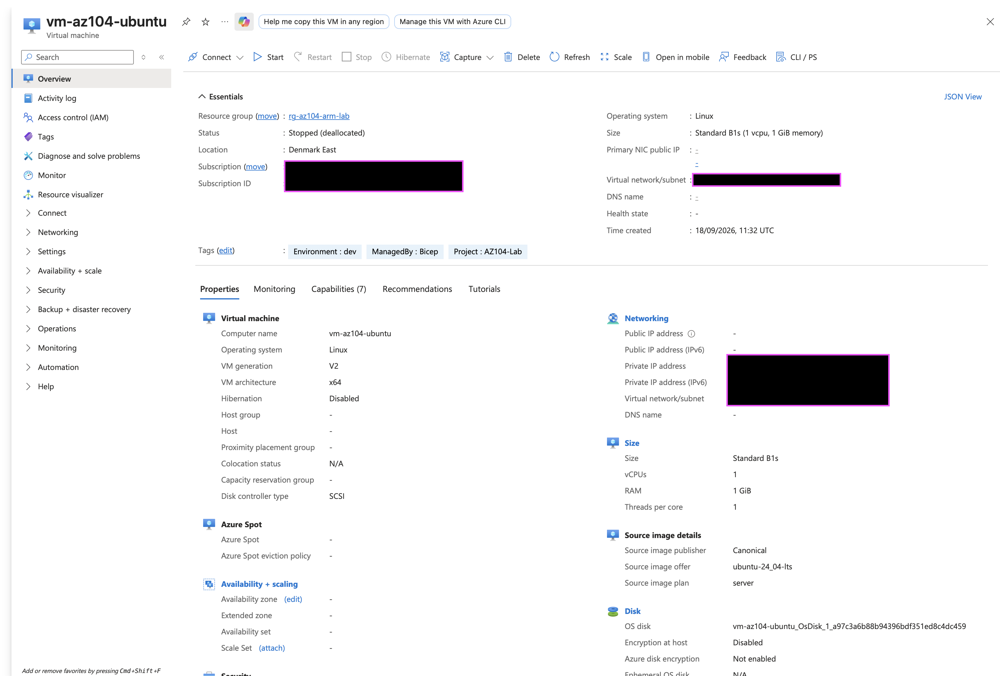
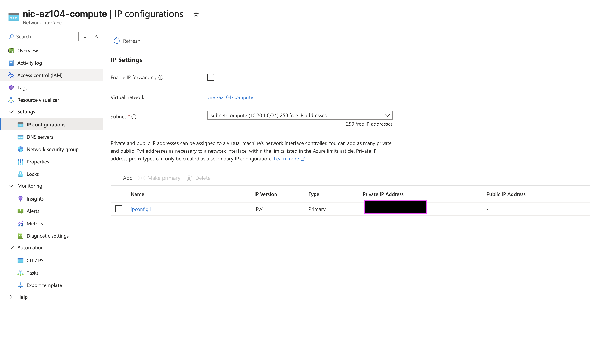
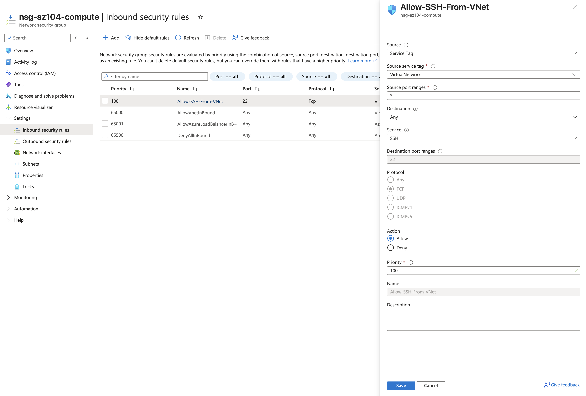
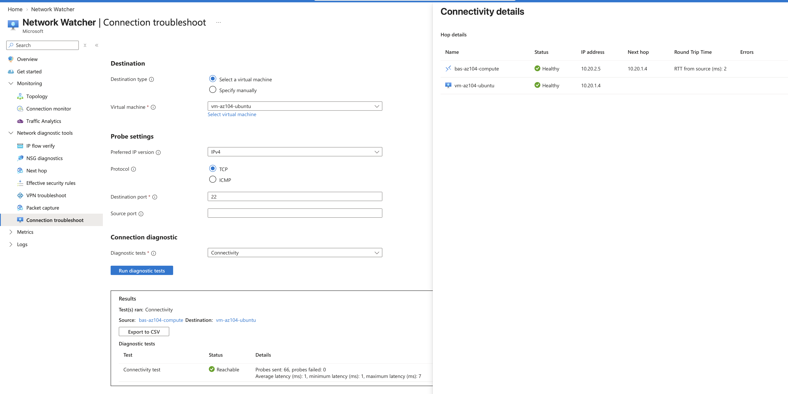
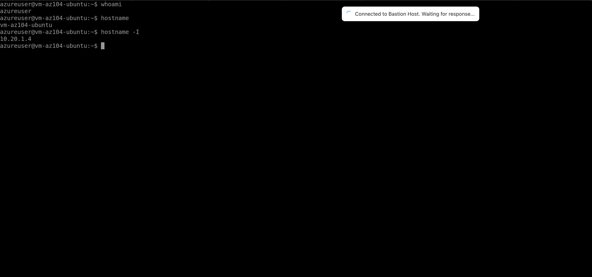

# AZ-104 Azure Infrastructure Lab

An Azure infrastructure project built while preparing for the Microsoft AZ-104 certification, demonstrating modular Bicep, private networking, Linux virtual machines, Azure Bastion, deployment review, secure administrative access, and operational verification.

## Project Overview

This lab follows a repeatable infrastructure deployment workflow:

**Build → Validate → What-If → Deploy → Verify**

The project has been developed incrementally, with each infrastructure change reviewed before deployment.

Key exercises completed so far include:

- deploying Azure infrastructure with modular Bicep
- troubleshooting a regional VM SKU restriction
- protecting existing resources during incremental deployments
- deploying a private Linux VM with no public IP
- configuring a dedicated Azure Bastion subnet
- deploying Azure Bastion for private administrative access
- validating the Bastion-to-VM network path with Network Watcher
- successfully connecting to the VM through Bastion using SSH key authentication
- reviewing effective NSG rules and effective routes during troubleshooting

The compute environment is deployed in Denmark East because the original UK South VM deployment encountered a subscription or regional SKU restriction.

---

## Infrastructure

| Component | Configuration |
|---|---|
| Resource group | `rg-az104-arm-lab` |
| Compute region | Denmark East |
| Virtual network | `vnet-az104-compute` |
| Compute subnet | `subnet-compute` — `10.20.1.0/24` |
| Bastion subnet | `AzureBastionSubnet` — `10.20.2.0/26` |
| Network security group | `nsg-az104-compute` |
| Network interface | `nic-az104-compute` |
| Virtual machine | `vm-az104-ubuntu` |
| Operating system | Ubuntu 24.04 LTS |
| VM size | `Standard_B1s` |
| VM private IP | `10.20.1.4` during recorded validation |
| VM public IP | None |
| Authentication | SSH public key |
| Bastion host | `bas-az104-compute` |
| Bastion SKU | Basic |
| Infrastructure as Code | Bicep |

---

## Architecture


```mermaid
flowchart TB
    User["Administrator / Browser"]

    subgraph RG["rg-az104-arm-lab"]
        subgraph Compute["Denmark East compute environment"]
            Bastion["Azure Bastion<br/>bas-az104-compute"]
            BastionSubnet["AzureBastionSubnet<br/>10.20.2.0/26"]

            VNet["vnet-az104-compute<br/>10.20.0.0/16"]
            ComputeSubnet["subnet-compute<br/>10.20.1.0/24"]
            NSG["nsg-az104-compute"]
            NIC["nic-az104-compute<br/>Private IP only"]
            VM["vm-az104-ubuntu<br/>Ubuntu 24.04 LTS"]
            Disk["Managed OS disk"]

            VNet --> BastionSubnet
            VNet --> ComputeSubnet

            BastionSubnet --> Bastion
            ComputeSubnet --> NIC
            NIC --> VM
            VM --> Disk

            NSG -. "TCP 22 from VirtualNetwork" .-> ComputeSubnet
        end
    end

    User -->|"HTTPS"| Bastion
    Bastion -->|"Private TCP 22"| VM
```

The VM does not have a public IP address.

Administrative SSH access is provided through Azure Bastion over the private virtual network.

---

## Private Access Design

The private management path is:

```text
Administrator Browser
        |
        | HTTPS
        v
Azure Bastion
10.20.2.5
        |
        | TCP 22
        v
Private Linux VM
10.20.1.4
```

The VM remains inaccessible directly from the public internet.

The NSG permits SSH from the `VirtualNetwork` service tag rather than exposing TCP port 22 to arbitrary internet sources.

---

## Repository Layout

```text
.
├── azuredeploy.bicep
├── azuredeploy.json
├── dev.bicepparam
├── audit-project-tag-policy.json
│
├── modules/
│   ├── bastion.bicep
│   ├── bastion.json
│   ├── compute.bicep
│   ├── compute.json
│   ├── network.bicep
│   ├── network.json
│   ├── storage.bicep
│   └── storage.json
│
├── docs/
│   └── screenshots/
│       ├── bastion-connectivity-test.png
│       ├── bastion-ssh-success.png
│       ├── nic-configuration.png
│       ├── nsg-ssh-rule.png
│       ├── vm-deallocated.png
│       └── what-if.png
│
├── README.md
└── learn.md
```

---

# Deployment Evidence

## Pre-deployment What-If Review

The original compute preview proposed four resource creations and left existing resources ignored, with no unintended deletions proposed.



This is historical evidence from an earlier deployment stage. Later What-If results changed as additional infrastructure was introduced.

---

## VM Verification and Deallocation

The original compute validation confirmed that the Linux VM was successfully provisioned in Denmark East using `Standard_B1s` with no public IP.

The VM was deallocated after the initial compute exercise to reduce unnecessary compute charges.



The VM was later started again temporarily to complete the Azure Bastion private-access exercise.

---

## Network Interface Configuration

The VM NIC connects to `subnet-compute` inside `vnet-az104-compute`.

Its primary IPv4 configuration does not have an associated public IP address.



This confirms that the VM itself is not directly exposed to the internet.

---

## SSH Security Rule

The `Allow-SSH-From-VNet` NSG rule permits inbound TCP traffic on port 22 from the `VirtualNetwork` service tag with priority 100.



The effective NSG was also inspected during Bastion troubleshooting and confirmed that the SSH allow rule was active.

---

## Bastion-to-VM Connectivity

Azure Network Watcher Connection Troubleshoot was used to validate the private TCP path from Azure Bastion to the VM.

The recorded test confirmed:

```text
Source:
bas-az104-compute
10.20.2.5

Destination:
vm-az104-ubuntu
10.20.1.4

Protocol:
TCP

Destination port:
22

Result:
Reachable
```

Both hops were reported as healthy.



This provided network-level evidence that Bastion could reach the private VM over SSH.

---

## Successful Private SSH Access

A successful SSH session was established through Azure Bastion using SSH private-key authentication.

The VM remained private and did not require a public IP address.

Inside the Bastion session, the following commands were used:

```bash
whoami
hostname
hostname -I
```

The recorded results were:

```text
azureuser
vm-az104-ubuntu
10.20.1.4
```



This completes the private VM access milestone.

---

# Deployment Workflow

## Prerequisites

- Azure CLI with Bicep support
- Azure subscription with suitable deployment permissions
- target resource group
- SSH key pair
- public SSH key available through the `AZ104_SSH_PUBLIC_KEY` environment variable
- VM SKU available in the selected compute region

Set the SSH public key before validating or deploying:

```bash
export AZ104_SSH_PUBLIC_KEY="$(cat ~/.ssh/az104_lab_ed25519.pub)"
```

The private key must remain on the local machine and must never be committed to the repository.

---

## 1. Build

```bash
az bicep build --file azuredeploy.bicep
```

Bicep modules can also be compiled independently during development:

```bash
az bicep build --file modules/network.bicep
az bicep build --file modules/bastion.bicep
```

---

## 2. Validate

```bash
az deployment group validate \
  --resource-group rg-az104-arm-lab \
  --parameters dev.bicepparam
```

Validation diagnostics should be reviewed rather than relying only on the overall deployment result.

---

## 3. Preview Changes

```bash
az deployment group what-if \
  --resource-group rg-az104-arm-lab \
  --parameters dev.bicepparam
```

A concise resource-level preview can also be generated with:

```bash
az deployment group what-if \
  --resource-group rg-az104-arm-lab \
  --parameters dev.bicepparam \
  --result-format ResourceIdOnly
```

What-If is reviewed before every deployment to identify unexpected creations, modifications, or deletions.

---

## 4. Deploy

The following command creates or updates Azure resources and can incur charges:

```bash
az deployment group create \
  --resource-group rg-az104-arm-lab \
  --parameters dev.bicepparam
```

---

## 5. Verify the VM

```bash
az vm show \
  --resource-group rg-az104-arm-lab \
  --name vm-az104-ubuntu \
  --show-details \
  --query "{Name:name,Location:location,Size:hardwareProfile.vmSize,ProvisioningState:provisioningState,PowerState:powerState,PrivateIP:privateIps,PublicIP:publicIps}" \
  --output table
```

---

## 6. Verify Bastion

```bash
az network bastion show \
  --resource-group rg-az104-arm-lab \
  --name bas-az104-compute \
  --query "{Name:name,Location:location,ProvisioningState:provisioningState,Sku:sku.name}" \
  --output table
```

Recorded provisioning state:

```text
Succeeded
```

---

## 7. Verify Subnets

```bash
az network vnet subnet list \
  --resource-group rg-az104-arm-lab \
  --vnet-name vnet-az104-compute \
  --query "[].{Name:name,AddressPrefix:addressPrefix}" \
  --output table
```

Expected network layout:

```text
subnet-compute       10.20.1.0/24
AzureBastionSubnet   10.20.2.0/26
```

---

# Troubleshooting and Engineering Decisions

## Regional VM SKU Restriction

The initial UK South compute deployment encountered a VM SKU restriction.

Instead of changing the location of existing infrastructure, a separate `computeLocation` parameter was introduced.

The compute environment was successfully deployed in Denmark East using `Standard_B1s`.

The key lesson was to distinguish infrastructure-code problems from Azure subscription or regional availability constraints.

---

## Protecting Existing Resources

Earlier infrastructure already existed inside the resource group.

The deployment used incremental mode, which retains resources omitted from the deployment template but can still modify resources included in the deployment.

Before applying changes, What-If was reviewed to identify which resources Azure intended to create or modify.

---

## Validation Warnings

Unused parameters remained after earlier module calls were temporarily removed from the active deployment path.

These warnings did not prevent deployment but identified template cleanup work.

Validation warnings are treated as engineering feedback rather than ignored simply because the deployment succeeds.

---

## NIC What-If Differences

A later What-If operation reported differences on the compute NIC involving properties such as:

```text
privateIPAddress
privateIPAddressVersion
kind
auxiliaryMode
```

These appeared to include service-generated or default Azure properties rather than intentional infrastructure changes.

The differences were investigated before deployment rather than automatically applying the preview.

---

## Private VM Access

Initially, the VM had:

- no public IP
- an NSG allowing TCP 22 from `VirtualNetwork`
- SSH public-key authentication

However, an NSG allow rule alone does not create a network path from an administrator workstation to a private VM.

Azure Bastion was therefore added to provide the secure management path.

A dedicated subnet was created:

```text
AzureBastionSubnet
10.20.2.0/26
```

Azure Bastion then provided SSH access to the VM without assigning the VM a public IP.

---

## Bastion Connection Troubleshooting

The first browser-based Bastion attempts disconnected before an SSH session was established.

The issue was investigated systematically rather than changing infrastructure randomly.

The following checks were performed:

### VM SSH Listener

Azure Run Command confirmed TCP port 22 was listening on the VM.

### SSH Key Verification

The local SSH public-key fingerprint was compared with the fingerprint stored in:

```text
/home/azureuser/.ssh/authorized_keys
```

The fingerprints matched.

### Effective NSG

The VM's effective security rules confirmed:

```text
Priority 100
Allow
VirtualNetwork
TCP 22
```

### Effective Route Table

The VM NIC showed:

```text
10.20.0.0/16
Next hop: VnetLocal
```

confirming a valid local route between the Bastion and compute subnets.

### Network Watcher

Connection Troubleshoot then confirmed the Bastion-to-VM TCP/22 path was healthy and reachable.

The final issue was traced to selecting the wrong local SSH private-key file in the browser file picker.

After selecting the dedicated Bastion private key, the SSH session succeeded.

This exercise demonstrated the importance of separating:

```text
Network reachability
        ↓
Security rules
        ↓
Routing
        ↓
SSH service availability
        ↓
Authentication
        ↓
Client configuration
```

---

# Security Controls

The current compute deployment demonstrates several security practices:

- VM has no public IP address
- password authentication is disabled
- SSH uses public-key authentication
- SSH private keys are not stored in Git
- NSG restricts SSH to `VirtualNetwork`
- Azure Bastion provides the administrative access path
- VM uses a system-assigned managed identity
- infrastructure is defined using Bicep
- What-If is reviewed before infrastructure changes are applied

The managed identity is currently provisioned but will be exercised with scoped Azure RBAC in the next phase of the lab.

---

# Cost Management

Azure infrastructure used in this lab can incur charges.

The VM can be deallocated when it is not required:

```bash
az vm deallocate \
  --resource-group rg-az104-arm-lab \
  --name vm-az104-ubuntu
```

Verify the power state:

```bash
az vm get-instance-view \
  --resource-group rg-az104-arm-lab \
  --name vm-az104-ubuntu \
  --query "instanceView.statuses[?starts_with(code, 'PowerState/')].displayStatus | [0]" \
  --output tsv
```

Azure Bastion is also a cost-bearing resource.

The Bicep deployment includes a `deployBastion` parameter so Bastion can remain disabled when it is not required.

Bastion can be removed after validation:

```bash
az network bastion delete \
  --resource-group rg-az104-arm-lab \
  --name bas-az104-compute \
  --yes
```

The associated Bastion public IP can also be deleted when it is no longer required.

Managed disks and other retained resources may continue to incur charges even when the VM is deallocated.

---

# Next Steps

The next phases of the lab will extend the environment beyond basic compute and networking.

Planned work:

- exercise the VM's system-assigned managed identity
- assign scoped Azure RBAC permissions
- restore Storage to the active Bicep architecture
- configure a Storage private endpoint
- configure Azure Private DNS
- add Azure Monitor and Log Analytics
- collect VM guest logs and metrics
- create a useful KQL query
- configure an Azure Monitor alert
- deploy and test Azure Policy
- demonstrate policy compliance and remediation
- configure VM backup
- create a recovery point and test restore
- add Bicep CI validation with GitHub Actions
- authenticate GitHub Actions to Azure using OIDC rather than client secrets
- remove remaining unused parameters and continue module cleanup

---

# Learning Notes

See [learn.md](learn.md) for troubleshooting decisions, deployment observations, and lessons learned during the lab.

---

## Author

**Olawale Azeez**

AWS Certified Developer – Associate  
AWS Certified Solutions Architect – Associate  
AWS Certified Cloud Practitioner

**Platform Engineer | AWS & Azure | Kubernetes | Terraform & Bicep | GitOps | CI/CD**