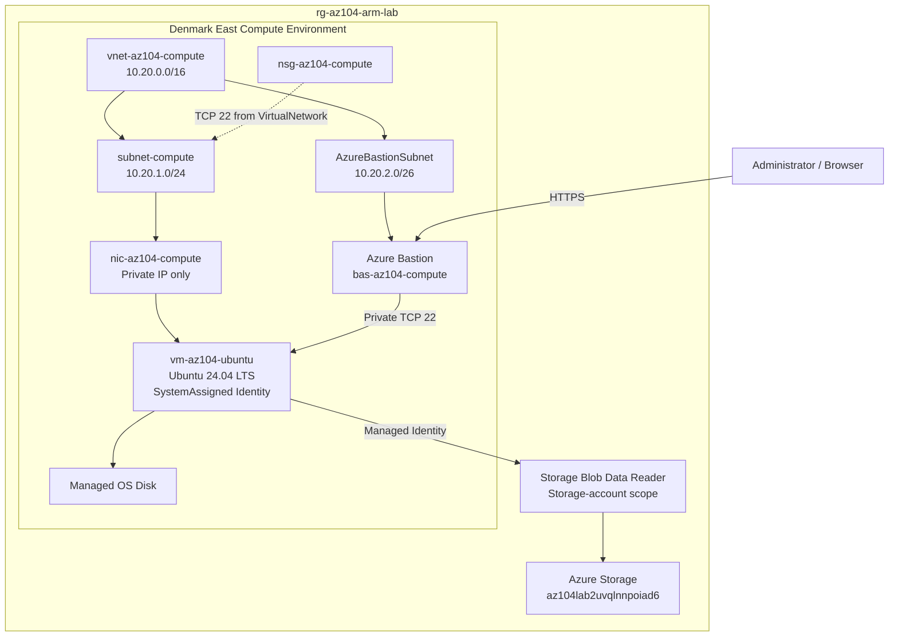
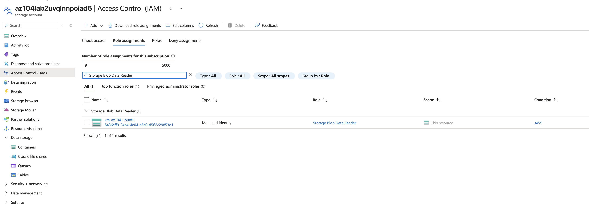
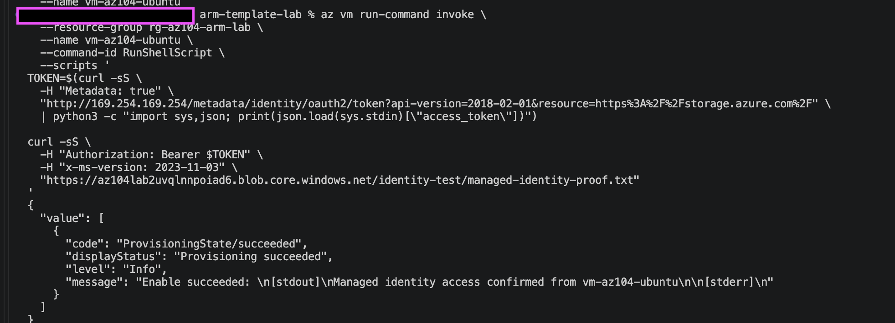

# AZ-104 Azure Infrastructure Lab

An Azure infrastructure project built while preparing for the Microsoft AZ-104 certification, demonstrating modular Bicep, private networking, Linux virtual machines, Azure Bastion, managed identities, scoped Azure RBAC, deployment review, troubleshooting, and operational verification.

## Project Overview

This lab follows a repeatable infrastructure deployment workflow:

**Build → Validate → What-If → Deploy → Verify**

The project is developed incrementally, with infrastructure changes reviewed before deployment and validated with both Azure CLI and Azure Portal evidence.

Completed exercises include:

- Modular Azure infrastructure using Bicep
- Regional VM SKU troubleshooting
- Private Linux VM deployment with no public IP
- NSG-based network controls
- Azure Bastion private administrative access
- Network Watcher connectivity validation
- System-assigned managed identity
- Scoped Azure RBAC
- Credential-free access to Azure Blob Storage
- Deterministic RBAC deployment through Bicep
- Effective NSG and route-table troubleshooting
- Cost-aware resource cleanup

The compute environment is deployed in Denmark East because an earlier UK South VM deployment encountered a subscription or regional SKU restriction.

---

## Infrastructure

| Component | Configuration |
|---|---|
| Resource group | `rg-az104-arm-lab` |
| Primary infrastructure region | UK South |
| Compute region | Denmark East |
| Virtual network | `vnet-az104-compute` |
| VNet address space | `10.20.0.0/16` |
| Compute subnet | `subnet-compute` — `10.20.1.0/24` |
| Bastion subnet | `AzureBastionSubnet` — `10.20.2.0/26` |
| Network security group | `nsg-az104-compute` |
| Network interface | `nic-az104-compute` |
| Virtual machine | `vm-az104-ubuntu` |
| Operating system | Ubuntu 24.04 LTS |
| VM size | `Standard_B1s` |
| VM public IP | None |
| VM authentication | SSH public key |
| VM identity | System-assigned managed identity |
| Bastion host | `bas-az104-compute` |
| Bastion SKU | Basic |
| Storage account | `az104lab2uvqlnnpoiad6` |
| Storage RBAC role | `Storage Blob Data Reader` |
| RBAC scope | Storage account |
| Infrastructure as Code | Bicep |

---

## Architecture


```mermaid
flowchart TB
    User["Administrator / Browser"]

    subgraph RG["rg-az104-arm-lab"]

        subgraph Compute["Denmark East Compute Environment"]
            VNet["vnet-az104-compute<br/>10.20.0.0/16"]

            BastionSubnet["AzureBastionSubnet<br/>10.20.2.0/26"]
            ComputeSubnet["subnet-compute<br/>10.20.1.0/24"]

            Bastion["Azure Bastion<br/>bas-az104-compute"]
            NSG["nsg-az104-compute"]

            NIC["nic-az104-compute<br/>Private IP only"]
            VM["vm-az104-ubuntu<br/>Ubuntu 24.04 LTS<br/>SystemAssigned Identity"]
            Disk["Managed OS Disk"]

            VNet --> BastionSubnet
            VNet --> ComputeSubnet

            BastionSubnet --> Bastion
            ComputeSubnet --> NIC
            NIC --> VM
            VM --> Disk

            NSG -. "TCP 22 from VirtualNetwork" .-> ComputeSubnet
        end

        Storage["Azure Storage<br/>az104lab2uvqlnnpoiad6"]

        RBAC["Storage Blob Data Reader<br/>Storage-account scope"]

        VM -->|"Managed Identity"| RBAC
        RBAC --> Storage
    end

    User -->|"HTTPS"| Bastion
    Bastion -->|"Private TCP 22"| VM
```

The VM does not have a public IP address.

Azure Bastion provides private administrative access when enabled.

The VM also has a system-assigned managed identity that receives scoped read-only access to Blob Storage through Azure RBAC.

---

# Security Model

The project currently demonstrates several Azure security controls.

```text
Administrator
     |
     | HTTPS
     v
Azure Bastion
     |
     | Private TCP 22
     v
Private Linux VM
     |
     | SystemAssigned Managed Identity
     v
Microsoft Entra ID
     |
     | Storage Blob Data Reader
     v
Azure Storage
```

Key security characteristics:

- The VM has no public IP address.
- Password-based SSH authentication is disabled.
- SSH uses public-key authentication.
- SSH private keys are never stored in Git.
- TCP port 22 is limited to `VirtualNetwork`.
- Azure Bastion provides the administrative network path.
- The VM uses a system-assigned managed identity.
- Storage authorization uses Azure RBAC.
- No Storage account key is required by the VM.
- No SAS token is required by the VM.
- No application password or client secret is stored on the VM.
- RBAC is scoped to the Storage account instead of the subscription.
- Infrastructure changes are reviewed using Azure What-If before deployment.

---

# Repository Layout

```text
.
├── azuredeploy.bicep
├── azuredeploy.json
├── dev.bicepparam
├── audit-project-tag-policy.json
│
├── modules/
│   ├── bastion.bicep
│   ├── bastion.json
│   ├── compute.bicep
│   ├── compute.json
│   ├── network.bicep
│   ├── network.json
│   ├── rbac.bicep
│   ├── rbac.json
│   ├── storage.bicep
│   └── storage.json
│
├── docs/
│   └── screenshots/
│       ├── bastion-connectivity-test.png
│       ├── bastion-ssh-success.png
│       ├── managed-identity-rbac.png
│       ├── managed-identity-storage-access.png
│       ├── nic-configuration.png
│       ├── nsg-ssh-rule.png
│       ├── vm-deallocated.png
│       └── what-if.png
│
├── README.md
└── learn.md
```

---

# Deployment Evidence

## Pre-deployment What-If Review

The original compute deployment was reviewed with Azure What-If before resources were created.

The preview was used to inspect proposed creations, modifications, deletions, and ignored resources before applying infrastructure changes.


This screenshot represents an earlier stage of the lab. Later What-If results changed as additional infrastructure and RBAC resources were introduced.

---

## VM Verification and Deallocation

The Linux VM was successfully provisioned in Denmark East using `Standard_B1s`.

The VM does not have a public IP address.

After validation exercises, it was deallocated to reduce unnecessary compute charges.


The VM is started only when required for validation exercises.

---

## Network Interface Configuration

The compute NIC connects the VM to `subnet-compute` inside `vnet-az104-compute`.

The NIC has no public IP association.


This confirms that the VM is not directly exposed to the public internet.

---

## SSH Security Rule

The `Allow-SSH-From-VNet` NSG rule permits inbound TCP traffic on port 22 from the `VirtualNetwork` service tag with priority 100.


Effective NSG rules were also inspected during troubleshooting to confirm the rule was active on the VM network path.

---

# Phase 1 — Private VM Access with Azure Bastion

## Bastion Network Design

A dedicated subnet was added to the compute VNet:

```text
vnet-az104-compute
10.20.0.0/16

├── subnet-compute
│   10.20.1.0/24
│
└── AzureBastionSubnet
    10.20.2.0/26
```

Azure Bastion provides the management path to the VM while allowing the VM itself to remain private.

The administrative path is:

```text
Administrator Browser
        |
        | HTTPS
        v
Azure Bastion
        |
        | TCP 22 over VNet
        v
vm-az104-ubuntu
Private IP only
```

---

## Bastion-to-VM Connectivity

Azure Network Watcher Connection Troubleshoot was used to validate the private network path.

The recorded test used:

```text
Source:
bas-az104-compute

Destination:
vm-az104-ubuntu

Protocol:
TCP

Destination port:
22
```

The test reported the connection as reachable.

Both the Bastion host and VM were reported as healthy.


This provided network-level evidence that Bastion could reach the VM over TCP port 22.

---

## Successful Bastion SSH Session

A successful SSH session was established through Azure Bastion using SSH private-key authentication.

Inside the VM, the following commands were executed:

```bash
whoami
hostname
hostname -I
```

Recorded results:

```text
azureuser
vm-az104-ubuntu
10.20.1.4
```


This completed the private VM access milestone.

The VM remained private throughout the exercise and did not require a public IP address.

---

# Phase 2 — Managed Identity and Scoped RBAC

## System-Assigned Managed Identity

The VM is configured in Bicep with a system-assigned managed identity:

```bicep
identity: {
  type: 'SystemAssigned'
}
```

Azure creates and manages the corresponding Microsoft Entra service principal.

No client secret or application password is required.

The compute module exposes the identity principal ID for use by other infrastructure modules.

---

## Scoped Storage RBAC

A reusable RBAC module assigns the built-in:

```text
Storage Blob Data Reader
```

role to the VM managed identity.

The assignment is scoped to the Storage account:

```text
az104lab2uvqlnnpoiad6
```

rather than to the entire resource group or subscription.

The relationship is:

```text
vm-az104-ubuntu
      |
      | SystemAssigned identity
      v
Storage Blob Data Reader
      |
      | Storage-account scope
      v
az104lab2uvqlnnpoiad6
```

---

## RBAC Bicep Module

The RBAC configuration is managed through `modules/rbac.bicep`.

The module accepts:

```text
principalId
principalResourceId
storageAccountName
```

The role assignment uses a deterministic resource name generated from stable Azure resource IDs.

This allows Azure What-If to identify the role assignment before deployment instead of reporting the resource as unsupported.

---

## What-If RBAC Validation

The final RBAC What-If preview identified the role assignment as a normal resource creation:

```text
Microsoft.Authorization/roleAssignments
```

rather than an unsupported deployment-time resource.

The final preview reported:

```text
1 resource to create
4 resources to deploy
17 resources to ignore
```

with no unexpected delete operation.

---

## Portal RBAC Verification

Azure Portal IAM shows the VM managed identity with the following assignment:

```text
Role:
Storage Blob Data Reader

Member:
vm-az104-ubuntu

Type:
Managed identity

Scope:
This resource
```



This confirms that the authorization assignment exists at the intended Storage account scope.

---

## Credential-Free Blob Access Test

A test Blob object was created:

```text
identity-test/
└── managed-identity-proof.txt
```

The VM requested an access token through Azure Instance Metadata Service:

```text
169.254.169.254
```

The access token was then used to access Azure Blob Storage.

No token value was printed or stored in the repository.

The test command returned:

```text
Managed identity access confirmed from vm-az104-ubuntu
```



This confirms that the VM can access Blob Storage using:

```text
System-assigned managed identity
        +
Microsoft Entra authentication
        +
Storage Blob Data Reader
```

without using:

```text
Storage account key
SAS token
Connection string
Password
Client secret
```

---

# Deployment Workflow

## Prerequisites

- Azure CLI
- Azure CLI Bicep support
- Azure subscription
- Required Azure deployment permissions
- Target resource group
- SSH key pair
- Public SSH key available through an environment variable
- VM SKU available in the selected region

Set the SSH public key before validation or deployment:

```bash
export AZ104_SSH_PUBLIC_KEY="$(cat ~/.ssh/az104_lab_ed25519.pub)"
```

Only the public key is passed into Bicep.

The private key remains on the local workstation and must never be committed to Git.

---

## 1. Build

Build the complete deployment:

```bash
az bicep build --file azuredeploy.bicep
```

Individual modules can also be validated independently:

```bash
az bicep build --file modules/network.bicep
az bicep build --file modules/compute.bicep
az bicep build --file modules/bastion.bicep
az bicep build --file modules/rbac.bicep
```

---

## 2. Validate

```bash
az deployment group validate \
  --resource-group rg-az104-arm-lab \
  --parameters dev.bicepparam
```

Validation diagnostics are reviewed rather than relying only on the final success state.

---

## 3. Preview Changes

```bash
az deployment group what-if \
  --resource-group rg-az104-arm-lab \
  --parameters dev.bicepparam
```

A resource-only preview can also be generated:

```bash
az deployment group what-if \
  --resource-group rg-az104-arm-lab \
  --parameters dev.bicepparam \
  --result-format ResourceIdOnly
```

What-If is reviewed before applying infrastructure changes.

---

## 4. Deploy

```bash
az deployment group create \
  --resource-group rg-az104-arm-lab \
  --parameters dev.bicepparam
```

Azure deployments can create billable resources.

The deployment preview is therefore reviewed before running this command.

---

# Verification Commands

## Verify the VM

```bash
az vm show \
  --resource-group rg-az104-arm-lab \
  --name vm-az104-ubuntu \
  --show-details \
  --query "{Name:name,Location:location,Size:hardwareProfile.vmSize,ProvisioningState:provisioningState,PowerState:powerState,PrivateIP:privateIps,PublicIP:publicIps}" \
  --output table
```

---

## Verify Managed Identity

```bash
az vm identity show \
  --resource-group rg-az104-arm-lab \
  --name vm-az104-ubuntu \
  --query "{PrincipalId:principalId,TenantId:tenantId,Type:type}" \
  --output table
```

Expected identity type:

```text
SystemAssigned
```

---

## Verify Storage RBAC

```bash
az role assignment list \
  --assignee <VM_MANAGED_IDENTITY_PRINCIPAL_ID> \
  --scope "$STORAGE_ID" \
  --query "[?roleDefinitionName=='Storage Blob Data Reader'].{Role:roleDefinitionName,PrincipalType:principalType,Scope:scope}" \
  --output table
```

Expected role:

```text
Storage Blob Data Reader
```

---

## Verify Bastion

When Bastion is deployed:

```bash
az network bastion show \
  --resource-group rg-az104-arm-lab \
  --name bas-az104-compute \
  --query "{Name:name,Location:location,ProvisioningState:provisioningState,Sku:sku.name}" \
  --output table
```

---

## Verify Subnets

```bash
az network vnet subnet list \
  --resource-group rg-az104-arm-lab \
  --vnet-name vnet-az104-compute \
  --query "[].{Name:name,AddressPrefix:addressPrefix}" \
  --output table
```

Expected:

```text
subnet-compute       10.20.1.0/24
AzureBastionSubnet   10.20.2.0/26
```

---

# Troubleshooting and Engineering Decisions

## Regional VM SKU Restriction

The original compute deployment attempted to use UK South.

The selected VM SKU was unavailable or restricted for the subscription in that region.

Instead of modifying unrelated infrastructure, a separate:

```text
computeLocation
```

parameter was introduced.

The compute environment was successfully deployed in Denmark East.

This demonstrated the importance of distinguishing:

```text
Infrastructure-code failure
```

from:

```text
Azure regional or subscription availability constraints
```

---

## Protecting Existing Resources

The resource group already contained infrastructure unrelated to the compute exercise.

The deployment therefore used incremental deployment mode and Azure What-If to review potential changes before deployment.

Resources omitted from the template remained in Azure.

Resources included in the template were still treated carefully because incremental mode can modify them.

---

## NIC What-If Differences

A later What-If operation reported differences on the NIC involving Azure-managed or default properties such as:

```text
privateIPAddress
privateIPAddressVersion
kind
auxiliaryMode
```

These differences were investigated before applying any change.

This reinforced that What-If output should be interpreted rather than blindly applied.

---

## Bastion Connection Troubleshooting

Initial Bastion browser sessions failed before a working SSH terminal was established.

Troubleshooting was performed layer by layer.

### SSH service

Azure Run Command confirmed that TCP port 22 was listening on the VM.

### SSH key

The local public-key fingerprint was compared with the fingerprint stored in:

```text
/home/azureuser/.ssh/authorized_keys
```

The fingerprints matched.

### Effective NSG

The VM's effective NSG showed:

```text
Priority: 100
Access: Allow
Source: VirtualNetwork
Destination port: 22
```

### Effective route table

The VM NIC showed:

```text
10.20.0.0/16
Next hop: VnetLocal
```

which confirmed local VNet routing between the Bastion and compute subnets.

### Network Watcher

Connection Troubleshoot confirmed the Bastion-to-VM TCP/22 path was healthy.

### Final cause

The browser file picker was initially using the wrong local SSH private-key file.

After selecting the correct dedicated private key, the Bastion SSH session succeeded.

The troubleshooting sequence demonstrated the value of separating:

```text
Network reachability
        ↓
Routing
        ↓
Security rules
        ↓
SSH listener
        ↓
Authentication
        ↓
Client configuration
```

---

## Managed Identity Authentication

The VM managed identity obtains an OAuth access token from Azure Instance Metadata Service.

The token request uses:

```text
http://169.254.169.254/metadata/identity/oauth2/token
```

The token is scoped for Azure Storage and is used to authenticate the Blob request.

The access token itself is not printed or stored.

---

## RBAC Authorization

Authentication and authorization are treated separately.

```text
Managed identity
    =
Who is the VM?

Azure RBAC
    =
What is the VM allowed to do?
```

The VM identity is authorized with:

```text
Storage Blob Data Reader
```

which allows read-only Blob data access at the selected Storage account scope.

---

## Deterministic Role Assignment

The first RBAC Bicep implementation generated the role assignment name using a deployment-time managed identity principal ID.

Azure What-If could not calculate the resulting resource ID and reported the role assignment as unsupported.

The design was changed so that the deterministic role-assignment GUID is based on stable Azure resource identifiers while the managed identity principal ID is used only as the RBAC assignee.

After this change, What-If identified the role assignment as a normal resource creation.

---

# Cost Management

## VM

The VM is deallocated when it is not required:

```bash
az vm deallocate \
  --resource-group rg-az104-arm-lab \
  --name vm-az104-ubuntu
```

Verify:

```bash
az vm get-instance-view \
  --resource-group rg-az104-arm-lab \
  --name vm-az104-ubuntu \
  --query "instanceView.statuses[?starts_with(code, 'PowerState/')].displayStatus | [0]" \
  --output tsv
```

Expected result:

```text
VM deallocated
```

Managed disks and some related resources can still incur charges while the VM is deallocated.

---

## Azure Bastion

Azure Bastion is also a billable resource.

The deployment therefore uses:

```bicep
param deployBastion bool = false
```

by default.

Bastion is enabled only when required for validation.

After the private-access exercise, the Bastion host can be removed:

```bash
az network bastion delete \
  --resource-group rg-az104-arm-lab \
  --name bas-az104-compute \
  --yes
```

Its public IP can also be deleted:

```bash
az network public-ip delete \
  --resource-group rg-az104-arm-lab \
  --name pip-bas-az104-compute
```

The `AzureBastionSubnet` can remain in the VNet for future Bastion deployments.

---

# Current Progress

```text
[Complete] Modular Bicep compute deployment
[Complete] Private Linux VM
[Complete] No VM public IP
[Complete] SSH public-key authentication
[Complete] NSG rule validation
[Complete] Azure Bastion deployment
[Complete] Private Bastion SSH session
[Complete] Network Watcher validation
[Complete] System-assigned managed identity
[Complete] Storage Blob Data Reader RBAC
[Complete] RBAC managed through Bicep
[Complete] Credential-free Blob read

[Next] Storage Private Endpoint
[Next] Azure Private DNS
[Next] Azure Monitor
[Next] Log Analytics
[Next] KQL queries
[Next] Azure Monitor alert
[Next] Azure Policy
[Next] Backup and recovery
[Next] GitHub Actions Bicep CI
[Next] GitHub-to-Azure OIDC
```

---

# Next Phase — Private Storage Connectivity

The next phase will evolve the current Storage access path.

The VM already uses managed identity and Azure RBAC for authentication and authorization.

The next step is to make the network path private as well:

```text
vm-az104-ubuntu
        |
        | Managed Identity
        |
        v
Storage Blob Data Reader

        +

vm-az104-ubuntu
        |
        | Private VNet
        v
Storage Private Endpoint
        |
        v
Azure Storage
```

Planned additions include:

```text
Private Endpoint
Private DNS Zone
privatelink.blob.core.windows.net
VNet DNS link
Private name resolution
Storage public-network review
```

This will separate three different security concerns:

```text
Authentication
Authorization
Network connectivity
```

---

# Future Work

After private Storage connectivity, the lab will continue with:

- Azure Monitor Agent
- Log Analytics workspace integration
- Data Collection Rules
- VM metrics and guest logs
- KQL queries
- Azure Monitor alerts
- Azure Policy definition and assignment
- deliberate policy non-compliance testing
- policy remediation
- Recovery Services Vault
- VM backup
- recovery point validation
- restore testing
- GitHub Actions Bicep validation
- Pull Request What-If
- Azure authentication through GitHub OIDC
- removal of remaining unused Bicep parameters
- continued module cleanup and refactoring

---

# Learning Notes

See [learn.md](learn.md) for troubleshooting decisions, deployment observations, and lessons learned throughout the lab.

---

## Author

**Olawale Azeez**

AWS Certified Developer – Associate  
AWS Certified Solutions Architect – Associate  
AWS Certified Cloud Practitioner

**Platform Engineer | AWS & Azure | Kubernetes | Terraform & Bicep | GitOps | CI/CD**